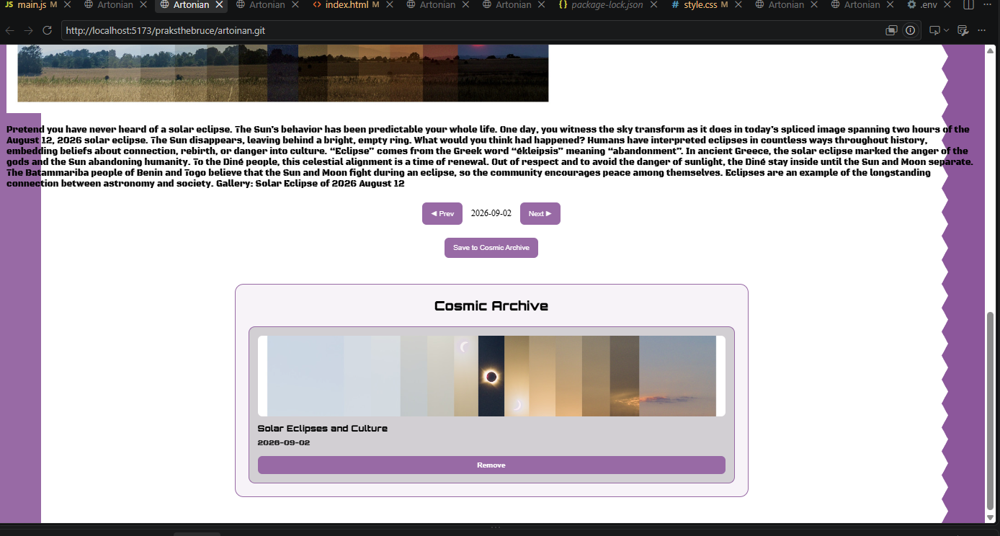

# Artonian

A NASA APOD explorer that lets you travel through the Astronomy Picture of the Day archive and save discoveries to your personal Cosmic Archive.



**[Try Artonian Live](https://artonian.netlify.app/)** · **[View Source](https://github.com/praksthebruce/artoinan)**

## Quick Start

Open the [live demo](https://artonian.netlify.app/) and start exploring.

To run Artonian locally:

```bash
git clone https://github.com/praksthebruce/artoinan.git
cd artoinan
npm install
npm run dev
```

You'll need a NASA API key in a `.env` file:

```env
VITE_NASA_API_KEY=your_api_key_here
```

## Features

- Explore NASA's Astronomy Picture of the Day by moving between dates.
- View both image and video APOD entries.
- Read the explanation behind each discovery.
- Save discoveries to the Cosmic Archive.
- Remove saved discoveries from the archive.
- Persist favorites locally using browser `localStorage`.
- Responsive space-themed interface.

## How It Works

Artonian uses NASA's APOD API as its source of astronomy content. When a date is loaded, the app requests that day's APOD data, checks the returned media type, and dynamically renders the appropriate content.

The Cosmic Archive is handled entirely in the browser using `localStorage`. This keeps the project lightweight while allowing saved discoveries to remain available between sessions without requiring a database or user account.

The project started as a simple exercise in working with an external API and grew into a small, usable astronomy explorer with date navigation and personal saved discoveries.

## Built With

- HTML
- CSS
- JavaScript
- Vite
- NASA APOD API
- Browser localStorage
- Google Fonts

## Credits

- Astronomy content and data provided through NASA's Astronomy Picture of the Day API.
- Fonts provided by Google Fonts.

## License

Built as an independent learning project.
